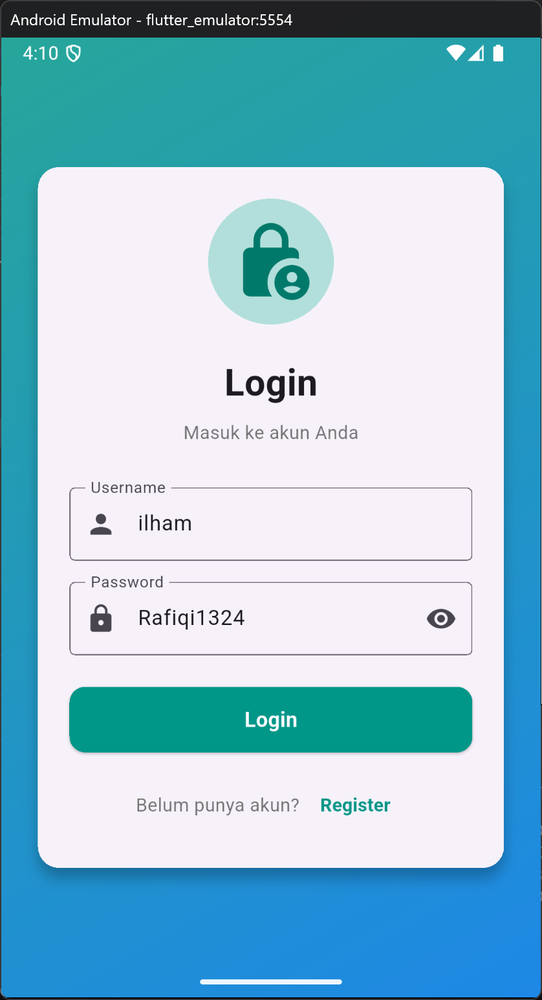

# Aplikasi Flutter Sederhana

**NIM:** H1D023112  
**Tugas 7:** Routes, Side Menu, Login, dan Local Storage


 
 


## Deskripsi
Aplikasi mobile dengan fitur login, register, dan manajemen profil. Data disimpan lokal menggunakan SharedPreferences.

## Fitur
- Register & Login
- Auto-login (session tersimpan)
- Profile, Settings, About
- Side drawer menu
- Logout

## Teknologi
- Flutter 3.35.7
- Provider (state management)
- SharedPreferences (local storage)

## Struktur
```
lib/
 main.dart
 pages/          # login, register, home, profile, settings, about
 providers/      # auth_provider
 services/       # storage_service
```

## Cara Menjalankan
```bash
flutter pub get
flutter run
```

## Cara Pakai
1. Register akun baru
2. Login dengan akun tersebut
3. Akses menu: Profile, Settings, About
4. Data tersimpan otomatis

## Penjelasan Kode

**storage_service.dart**  
Menyimpan data user di SharedPreferences (format JSON).

**auth_provider.dart**  
Mengelola state login/logout dengan Provider.

**Pages**  
6 halaman: Login, Register, Home, Profile, Settings, About.

---
Made with Flutter 
